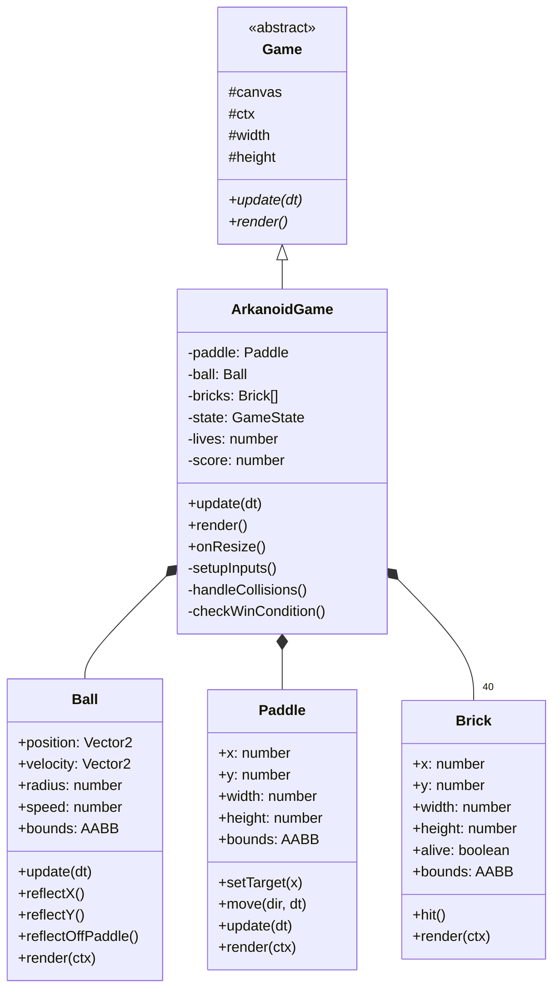
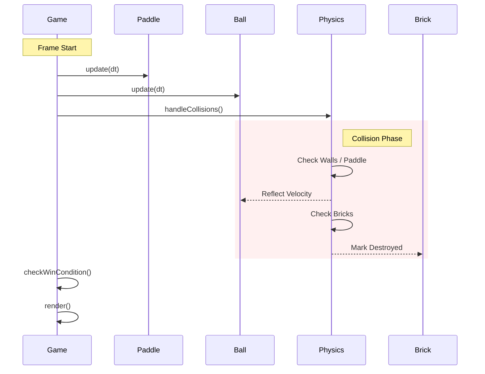
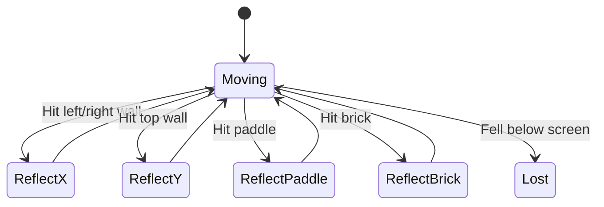
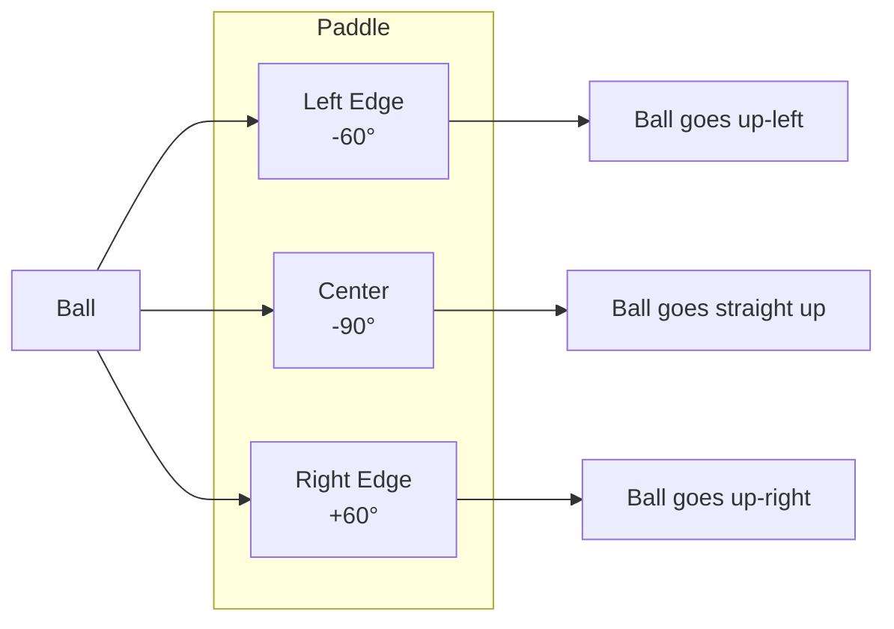
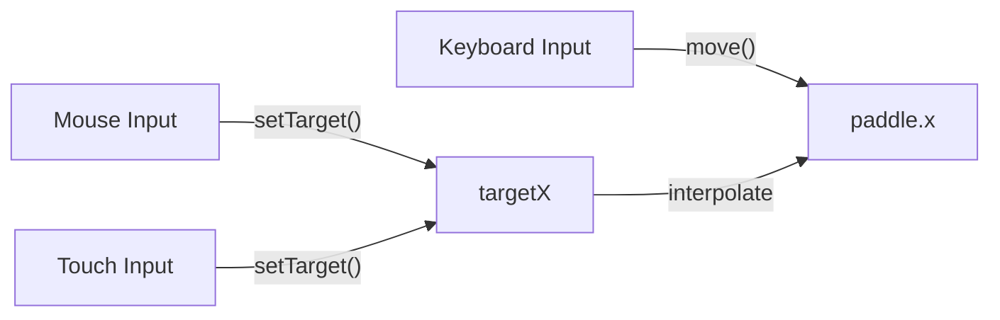
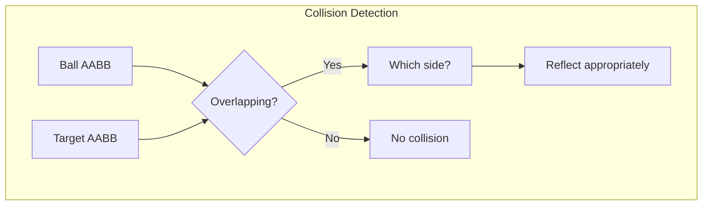
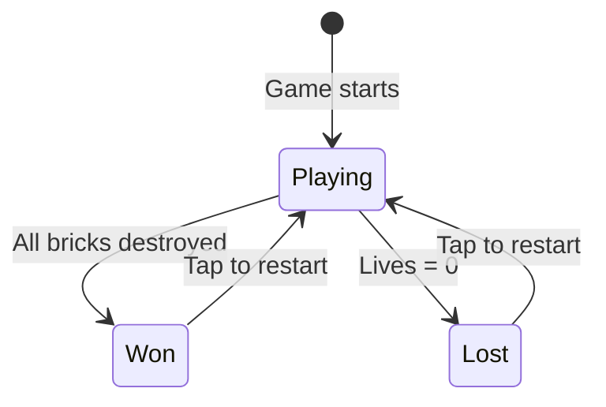
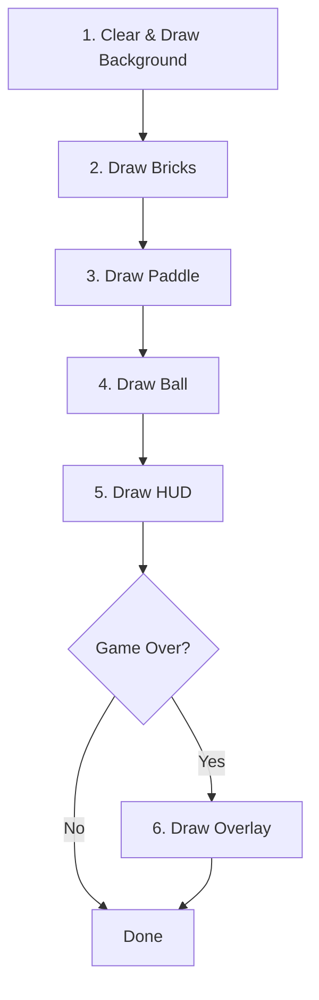

# Arkanoid Game Design Document

> **Document Version:** 1.0  
> **Last Updated:** January 2026  
> **Audience:** Game Developers, Contributors, and Technical Stakeholders

---

## Executive Summary

This document describes the design and implementation of Arkanoid, a brick-breaking arcade game built on the game-scaffold framework. The implementation serves as a reference for how to build games using the framework while demonstrating best practices for entity design, collision detection, state management, and cross-platform input handling.

---

## Table of Contents

1. [Game Overview](#game-overview)
2. [Architecture](#architecture)
3. [Entity Design](#entity-design)
   - [Ball](#ball)
   - [Paddle](#paddle)
   - [Brick](#brick)
4. [Physics & Collision System](#physics--collision-system)
5. [Game State Management](#game-state-management)
6. [Input System](#input-system)
7. [Rendering Pipeline](#rendering-pipeline)
8. [Code Reference Guide](#code-reference-guide)

---

## Game Overview

### What Is Arkanoid?

Arkanoid is a classic arcade game where the player controls a paddle at the bottom of the screen to bounce a ball into a grid of colored bricks. When the ball hits a brick, the brick is destroyed and the player earns points. The goal is to destroy all bricks without letting the ball fall below the paddle.

### Why Build This Game?

Arkanoid was chosen as the reference implementation because it exercises all major game development concepts:

| Concept | Arkanoid Implementation |
|---------|------------------------|
| **Entity Management** | Ball, Paddle, Bricks (40 objects) |
| **Physics** | Velocity, reflection, position updates |
| **Collision Detection** | Ball vs walls, paddle, and bricks |
| **State Machine** | Playing, Won, Lost states |
| **Input Handling** | Keyboard, mouse, and touch support |
| **HUD Rendering** | Score and lives display |

### Game Rules

1. Player starts with **3 lives**
2. Ball bounces off walls, paddle, and bricks
3. Each brick destroyed awards **10 points**
4. Ball falling below paddle loses **1 life**
5. **Win condition**: All bricks destroyed
6. **Lose condition**: All lives lost
7. Tap/click to restart after game over

---

## Architecture

### Why This Structure?

The Arkanoid implementation follows the **Entity-Component pattern** at a minimal level—each game object is a self-contained class with its own update and render methods. This keeps the code:

1. **Readable**: Each file has a single responsibility
2. **Testable**: Entities can be tested in isolation
3. **Reusable**: Ball and Paddle could be used in other games

### Class Hierarchy



### Game Loop Sequence

The specific update flow for Arkanoid:



### File Organization

```
src/
├── ArkanoidGame.ts          # Main game class
├── entities/
│   ├── Ball.ts              # Ball entity
│   ├── Paddle.ts            # Paddle entity
│   ├── Brick.ts             # Brick entity + factory
│   └── index.ts             # Barrel exports
└── utils/
    └── math.ts              # Vector2, AABB, collision
```

---

## Entity Design

### Design Philosophy

Each entity in Arkanoid follows a consistent pattern:

```typescript
class Entity {
  // Position and dimensions
  // Computed AABB bounds getter
  // update(dt: number): void - Physics/logic
  // render(ctx: CanvasRenderingContext2D): void - Drawing
}
```

This pattern was chosen because:

1. **Encapsulation**: Entities own their data and behavior
2. **Polymorphism**: All entities can be updated and rendered uniformly
3. **Composition**: ArkanoidGame composes entities rather than inheriting them

---

### Ball

#### Why This Design?

The ball is the most complex entity because it:

- Moves continuously with velocity
- Reflects off surfaces at different angles
- Changes angle based on where it hits the paddle

#### Implementation Details

**File**: [entities/Ball.ts](file:///Users/bgdan/projects/experimental/canvas_game/game-scaffold/src/entities/Ball.ts)



**Position & Velocity:**

```typescript
export class Ball {
  position: Vector2;      // Current center position
  velocity: Vector2;      // Direction and speed combined
  readonly radius: number = 8;
  readonly speed: number = 400;  // Pixels per second
}
```

**Why Vector2 for velocity?** Storing direction and magnitude together simplifies physics:

```typescript
// Update is just: position += velocity * dt
update(dt: number): void {
  this.position = this.position.add(this.velocity.scale(dt));
}
```

**Paddle Reflection Algorithm:**

When the ball hits the paddle, it doesn't simply reflect. Instead, the exit angle depends on where the ball hits:



**Implementation:**

```typescript
reflectOffPaddle(paddleCenterX: number, paddleWidth: number): void {
  // hitPos ranges from -1 (left edge) to +1 (right edge)
  const hitPos = (this.position.x - paddleCenterX) / (paddleWidth / 2);
  
  // Map to angle: -90° ± 60°
  const maxAngle = Math.PI / 3;  // 60 degrees
  const angle = -Math.PI / 2 + hitPos * maxAngle;
  
  // Set new velocity from angle
  this.velocity = new Vector2(
    Math.cos(angle) * this.speed,
    Math.sin(angle) * this.speed
  );
}
```

**Why this approach?** 

1. **Player Control**: Skilled players can aim the ball by hitting it with different parts of the paddle
2. **Predictability**: The ball's behavior is deterministic—same hit position = same angle
3. **Game Feel**: Makes the game feel responsive and skill-based

---

### Paddle

#### Why This Design?

The paddle must respond to three input methods:

1. **Keyboard**: Discrete left/right movement
2. **Mouse**: Continuous position tracking
3. **Touch**: Finger position following

Rather than implementing three separate movement systems, the paddle uses a **target-based approach**:



#### Implementation Details

**File**: [entities/Paddle.ts](file:///Users/bgdan/projects/experimental/canvas_game/game-scaffold/src/entities/Paddle.ts)

**Target-Based Movement:**

```typescript
export class Paddle {
  x: number;           // Actual position
  private targetX: number;  // Desired position (from mouse/touch)
  readonly speed: number = 800;  // For keyboard movement

  setTarget(x: number): void {
    this.targetX = x;
  }

  move(direction: number, dt: number, screenWidth: number): void {
    this.x += direction * this.speed * dt;
    this.clamp(screenWidth);
    this.targetX = this.x;  // Sync target with keyboard position
  }

  update(dt: number, screenWidth: number): void {
    // Smooth interpolation toward target
    const diff = this.targetX - this.x;
    this.x += diff * Math.min(1, dt * 15);
    this.clamp(screenWidth);
  }
}
```

**Why interpolation instead of instant movement?**

1. **Smooth visuals**: Even at low framerates, the paddle moves smoothly
2. **Natural feel**: Mimics physical inertia
3. **Prevents teleporting**: Mouse jumps don't cause jarring movement

**Clamping:**

```typescript
private clamp(screenWidth: number): void {
  const halfWidth = this.width / 2;
  this.x = Math.max(halfWidth, Math.min(screenWidth - halfWidth, this.x));
}
```

The paddle's `x` is its center, so clamping accounts for half the width on each side.

---

### Brick

#### Why This Design?

Bricks are simple entities that:

1. Have a position, size, and color
2. Can be "hit" (destroyed)
3. Render themselves with a slight highlight effect

The key design decision was using a **factory function** to create the brick grid rather than embedding grid logic in the ArkanoidGame class.

#### Implementation Details

**File**: [entities/Brick.ts](file:///Users/bgdan/projects/experimental/canvas_game/game-scaffold/src/entities/Brick.ts)

**Color Scheme:**

```typescript
const ROW_COLORS = [
  '#e94560',  // Red
  '#ff6b6b',  // Light red
  '#feca57',  // Yellow
  '#48dbfb',  // Cyan
  '#1dd1a1',  // Green
  '#5f27cd',  // Purple
];
```

**Why row-based colors?** Visual variety makes the game more appealing, and colored rows give players a sense of progress as they clear from bottom to top.

**Factory Function:**

```typescript
export function createBrickGrid(
  screenWidth: number,
  rows: number = 5,
  cols: number = 8,
  topOffset: number = 60,
  padding: number = 8
): Brick[] {
  const bricks: Brick[] = [];
  const totalPadding = padding * (cols + 1);
  const brickWidth = (screenWidth - totalPadding) / cols;
  const brickHeight = 24;

  for (let row = 0; row < rows; row++) {
    for (let col = 0; col < cols; col++) {
      const x = padding + col * (brickWidth + padding);
      const y = topOffset + row * (brickHeight + padding);
      bricks.push(new Brick(x, y, brickWidth, brickHeight, row));
    }
  }

  return bricks;
}
```

**Why a factory function?**

1. **Separation of concerns**: Grid layout logic is separate from Brick behavior
2. **Flexibility**: Easy to customize rows, columns, padding
3. **Responsive**: Brick width adapts to screen width
4. **Testability**: Can generate grids without a full game instance

---

## Physics & Collision System

### Why AABB Collision?

Axis-Aligned Bounding Box (AABB) collision detection is:

1. **Fast**: Just 4 comparisons per pair
2. **Simple**: No rotation to handle
3. **Sufficient**: All game objects are rectangles (ball is treated as a square bounding its circle)



### Collision Resolution Order

The order of collision checks matters:

```typescript
private handleCollisions(): void {
  // 1. Wall collisions (always checked first)
  // 2. Bottom boundary (lose life - exits early)
  // 3. Paddle collision (checked before bricks)
  // 4. Brick collisions (only one per frame)
}
```

**Why this order?**

1. **Walls first**: Prevents ball from escaping screen bounds
2. **Bottom boundary**: Losing a life resets the ball, so other checks are irrelevant
3. **Paddle before bricks**: Paddle is closer to bottom, more common collision
4. **One brick per frame**: Prevents "tunneling" through multiple bricks

### Collision Side Detection

**File**: [utils/math.ts](file:///Users/bgdan/projects/experimental/canvas_game/game-scaffold/src/utils/math.ts)

To reflect the ball correctly, we need to know which side of the target was hit:

```typescript
export function getCollisionSide(
  ball: AABB,
  target: AABB,
  ballVelocity: Vector2
): 'top' | 'bottom' | 'left' | 'right' | null {
  if (!aabbCollision(ball, target)) return null;

  // Calculate overlap on each axis
  const overlapLeft = ball.x + ball.width - target.x;
  const overlapRight = target.x + target.width - ball.x;
  const overlapTop = ball.y + ball.height - target.y;
  const overlapBottom = target.y + target.height - ball.y;

  // Find minimum overlap
  const minOverlapX = Math.min(overlapLeft, overlapRight);
  const minOverlapY = Math.min(overlapTop, overlapBottom);

  // Use velocity to disambiguate
  if (minOverlapX < minOverlapY) {
    return ballVelocity.x > 0 ? 'left' : 'right';
  } else {
    return ballVelocity.y > 0 ? 'top' : 'bottom';
  }
}
```

**Why use velocity for disambiguation?**

When overlaps are similar, velocity tells us which direction the ball came from:

```
Ball moving right (vx > 0) + hit = ball hit target's LEFT side
Ball moving down (vy > 0) + hit = ball hit target's TOP
```

---

## Game State Management

### State Machine



### Implementation

**State Type:**

```typescript
type GameState = 'playing' | 'won' | 'lost';
```

**State Transitions:**

```typescript
// In handleCollisions():
if (ball.position.y - ball.radius > this.height) {
  this.lives--;
  if (this.lives <= 0) {
    this.state = 'lost';  // Transition to lost
  } else {
    this.resetBall();     // Continue playing
  }
}

// In checkWinCondition():
private checkWinCondition(): void {
  const remaining = this.bricks.filter((b) => b.alive).length;
  if (remaining === 0) {
    this.state = 'won';   // Transition to won
  }
}
```

**Why string union types?**

1. **Type safety**: TypeScript catches typos like `'winn'`
2. **Self-documenting**: States are clear from the type definition
3. **Exhaustiveness**: Switch statements can be checked for completeness

### Update Gating

When the game is over, we stop updating physics but continue rendering:

```typescript
protected update(dt: number): void {
  if (this.state !== 'playing') return;  // Gate all updates
  
  // Physics and input only run while playing
  this.paddle.update(dt, this.width);
  this.ball.update(dt);
  this.handleCollisions();
  this.checkWinCondition();
}
```

---

## Input System

### Multi-Platform Support

The game supports three input methods simultaneously:

| Input | API | Usage |
|-------|-----|-------|
| Keyboard | `keydown`/`keyup` | Arrow keys, A/D for paddle movement |
| Mouse | `mousemove` | Paddle follows cursor X |
| Touch | `touchmove` | Paddle follows finger X |

### Implementation Details

**File**: [ArkanoidGame.ts](file:///Users/bgdan/projects/experimental/canvas_game/game-scaffold/src/ArkanoidGame.ts)

**Keyboard State Tracking:**

```typescript
// In update():
// Use the inherited input manager (this.input)
if (this.input.isKeyDown('ArrowLeft') || this.input.isKeyDown('a')) {
  this.paddle.move(-1, dt, this.width);
}
```

**Why InputManager?**

1.  **Unified API**: Standardized access to all input types.
2.  **Frame-Based**: Input state is captured once per frame, ensuring determinism.
3.  **Clean Code**: No need to manually manage `Set<string>` or event listeners in the game class.

**Mouse/Touch Handling:**

```typescript
```typescript
// In update():
const pointer = this.input.pointerPosition;
if (pointer) {
  this.paddle.setTarget(pointer.x);
}
```
```

**Why `passive: false`?**

To call `preventDefault()` on touch events, the listener must not be passive. This prevents the browser from scrolling or zooming when the player drags their finger.

**Restart Handling:**

```typescript
```typescript
// In update():
if ((this.state === 'won' || this.state === 'lost') && this.input.isPointerPressed()) {
  this.handleRestart();
}

private handleRestart(): void {
  if (this.state === 'won' || this.state === 'lost') {
    this.lives = 3;
    this.score = 0;
    this.resetLevel();
  }
}
```

The state check ensures taps during gameplay don't accidentally restart.

---

## Rendering Pipeline

### Render Order

The rendering order creates proper visual layering:



**Why this order?**

1. **Background first**: Everything draws on top
2. **Bricks before paddle/ball**: Ball and paddle are "in front" visually
3. **HUD last**: Always visible above game elements
4. **Overlay on top**: Dimmed game shows through

### Visual Design

**Color Palette:**

| Element | Color | Hex |
|---------|-------|-----|
| Background | Dark blue | `#0f0f23` |
| Ball | Coral red | `#e94560` |
| Paddle | Navy | `#16213e` |
| Bricks | Rainbow | Row-based |
| HUD Text | White | `#fff` |

**Brick Highlights:**

```typescript
render(ctx: CanvasRenderingContext2D): void {
  if (!this.alive) return;

  ctx.fillStyle = this.color;
  ctx.beginPath();
  ctx.roundRect(this.x, this.y, this.width, this.height, 3);
  ctx.fill();

  // Subtle highlight for depth
  ctx.fillStyle = 'rgba(255, 255, 255, 0.2)';
  ctx.fillRect(this.x + 2, this.y + 2, this.width - 4, 4);
}
```

**Why the highlight?** A 4-pixel translucent white bar at the top of each brick creates a subtle 3D effect, making bricks look like physical objects rather than flat rectangles.

### HUD Rendering

```typescript
private renderHUD(): void {
  const ctx = this.ctx;
  ctx.fillStyle = '#fff';
  ctx.font = 'bold 16px system-ui, sans-serif';
  
  // Score (left)
  ctx.textAlign = 'left';
  ctx.textBaseline = 'top';
  ctx.fillText(`Score: ${this.score}`, 12, 12);
  
  // Lives (right, using emoji hearts)
  ctx.textAlign = 'right';
  ctx.fillText(`Lives: ${'❤️'.repeat(this.lives)}`, this.width - 12, 12);
}
```

**Why emoji hearts?** 

1. Visual appeal without loading images
2. Universal Unicode support
3. Instantly recognizable meaning

---

## Code Reference Guide

### Quick Links

| File | Purpose | Key Methods |
|------|---------|-------------|
| [ArkanoidGame.ts](file:///Users/bgdan/projects/experimental/canvas_game/game-scaffold/src/ArkanoidGame.ts) | Main game class | `update()`, `render()`, `handleCollisions()` |
| [Ball.ts](file:///Users/bgdan/projects/experimental/canvas_game/game-scaffold/src/entities/Ball.ts) | Ball physics | `reflectOffPaddle()`, `update()` |
| [Paddle.ts](file:///Users/bgdan/projects/experimental/canvas_game/game-scaffold/src/entities/Paddle.ts) | Player input | `setTarget()`, `move()`, `update()` |
| [Brick.ts](file:///Users/bgdan/projects/experimental/canvas_game/game-scaffold/src/entities/Brick.ts) | Bricks & grid | `createBrickGrid()`, `hit()` |
| [math.ts](file:///Users/bgdan/projects/experimental/canvas_game/game-scaffold/src/utils/math.ts) | Collision math | `aabbCollision()`, `getCollisionSide()` |

### Constants Reference

| Constant | Value | Location |
|----------|-------|----------|
| Ball radius | 8px | `Ball.ts` |
| Ball speed | 400 px/s | `Ball.ts` |
| Paddle width | 100px | `Paddle.ts` |
| Paddle height | 14px | `Paddle.ts` |
| Paddle speed | 800 px/s | `Paddle.ts` |
| Brick rows | 5 | `createBrickGrid()` |
| Brick columns | 8 | `createBrickGrid()` |
| Brick height | 24px | `createBrickGrid()` |
| Points per brick | 10 | `ArkanoidGame.ts` |
| Starting lives | 3 | `ArkanoidGame.ts` |

---

## Appendix: Potential Enhancements

The current implementation provides a solid foundation. Future enhancements could include:

| Feature | Complexity | Description |
|---------|------------|-------------|
| Power-ups | Medium | Items that fall from destroyed bricks (wider paddle, multi-ball, etc.) |
| Sound effects | Low | Audio feedback for collisions and game events |
| Multiple levels | Medium | Different brick patterns loaded from data |
| High scores | Low | Local storage persistence |
| Particle effects | Medium | Visual polish on brick destruction |
| Mobile vibration | Low | Haptic feedback via Capacitor |

---

*End of Document*
