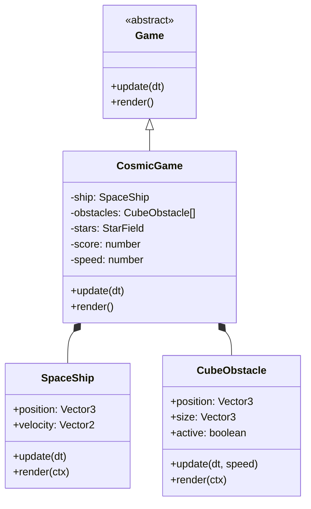

# Cosmic Cube Runner Design Document

> **Document Version:** 1.0
> **Status:** Draft
> **Tech Stack:** TypeScript, HTML5 Canvas, Pseudo-3D (Vector3)

---

## 1. Game Overview

**Cosmic Cube Runner** is an infinite runner where the player pilots a spaceship forward through a dense field of incoming cubic obstacles. The game utilizes "Pseudo-3D" projection to create depth on a 2D canvas.

### Core Mechanics
-   **Perspective**: Third-person follow (camera behind ship).
-   **Movement**: Player moves Left/Right (X-axis) and can hover Up/Down (Y-axis). Z-axis is fixed for the player.
-   **Obstacles**: Cubes spawn at a far Z distance (e.g., $z=100$) and move towards the camera ($z=0$).
-   **Goal**: Survive as long as possible. Score increases with distance traveled.

---

## 2. Architecture

The game extends the core `Game` class and utilizes the `Vector3` utility for 3D logic.



---

## 3. The 3D Implementation

### Coordinate System
-   **Origin (0,0,0)**: Center of the screen, at the camera lens.
-   **Player Position**: Fixed at $z=1$ (Screen Plane). $x, y$ are dynamic.
-   **Spawn Position**: $z=100$ (Far distance).
-   **Death Zone**: $z < 0.5$ (Behind camera).

### Projection Logic (Vector3.ts)
We use the existing `Vector3.project()` method:
$$
x_{screen} = x_{world} / z_{world}
$$
*Note: We must offset by screen center ($width/2, height/2$) so (0,0) is in the middle.*

### Rendering "Volume" (The Cube Effect)
To make a 2D rectangle look like a 3D cube:
1.  **Front Face**: Project the cube's front vertices (at $z$).
2.  **Back Face**: Project the cube's back vertices (at $z + depth$).
3.  **Connecting Lines**: Draw lines between Front Top-Left and Back Top-Left, etc.

---

## 4. Entity Design

### SpaceShip
-   **Visual**: Simple triangular wireframe or sprite.
-   **Controls**:
    -   `ArrowLeft` / `A`: Move Left (-x)
    -   `ArrowRight` / `D`: Move Right (+x)
    -   `ESC`: Pause / Resume Game.
    -   `Space`: Restart Game (on Game Over).
-   **Bounds**: AABB at $z=1$.

### CubeObstacle
-   **Visual**: Wireframe box.
    -   Color intensity fades based on Z (fog effect).
-   **Logic**:
    -   `z -= dt * gameSpeed`
    -   If $z < 1$ (passes player), check collision.
    -   If $z < 0$ (behind camera), remove/recycle.

### StarField (Background)
-   Array of points with random $(x, y, z)$.
-   When $z < 0$, respawn at $z=100$.
-   Creates the sensation of speed.

---

## 5. Collision Detection

Since the player is fixed at $z \approx 1$, we only check collisions when an obstacle enters the "Danger Zone" ($z \approx 1$).

```typescript
// Pseudo-code
if (obstacle.z < player.z + epsilon && obstacle.z > player.z - epsilon) {
  // We are at the same depth, check 2D overlap
  // Threshold reduced to 45 for better visual accuracy
  if (Math.abs(obstacle.x - player.x) < 45) {
    GameOver();
  }
}
```

---

## 6. Game Loop

### Update Phase
1.  **Player**: Update $x, y$ based on Input. Clamp to screen limits (calculated via projection inverse).
2.  **Spawner**: Every $N$ seconds, spawn specific patterns of cubes.
3.  **Obstacles**: Move all cubes by `-speed * dt`. Remove passed cubes.
4.  **Collision**: Check near-field objects against player.

### Render Phase
1.  **Clear**: Fill black.
2.  **Stars**: Render white dots projected from 3D.
3.  **Obstacles**: Sort by $z$ (Painter's Algo: far to near). Render cubes.
4.  **Player**: Render ship on top (since it's at $z=1$, usually the closest).
5.  **UI**: Score and Speed.

---

## 7. Future Expansions
-   **Curved World**: Apply $y += x^2$ factor before projection to create a "tunnel" or "horizon" curve.
-   **Rotations**: Rolling the ship banking into turns.
