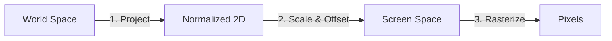

# Introduction to Computer Graphics

> **Prerequisites:** Basic algebra, familiarity with standard Cartesian coordinates.  
> **Goal:** Understand the "Magic Trick" of converting a 3D world into a 2D image, and how this specific engine implements it.

---

## 1. The Two Worlds: Coordinate Systems

To render a game, we must bridge the gap between two very different coordinate systems:

### World Space (The Virtual World)
This is where your game logic lives. It is an infinite 3D space where objects exist.
*   **Axes**: $x$ (Right), $y$ (Down), $z$ (Forward/Depth).
*   **Origin (0,0,0)**: The center of the world.
*   **Units**: Arbitrary "game units" (meters, yards, pixels, etc.).

### Screen Space (The Physical Screen)
This is the finite 2D rectangle of your monitor or phone.
*   **Axes**: $x$ (Right), $y$ (Down).
*   **Origin (0,0)**: The **Top-Left** corner of the canvas.
*   **Units**: Physical Pixels.

> **Crucial Difference**: In math, $(0,0)$ is the center. In computer screens, $(0,0)$ is the top-left. We must handle this conversion.

---

## 2. The Graphics Pipeline

How does a `Vector3(100, 50, 10)` in World Space become a colored dot on your screen? It goes through a **Pipeline**.

In our engine, the pipeline is simplified into three stages:



1.  **Project**: Convert 3D $(x,y,z)$ to 2D $(x,y)$ based on depth.
2.  **Scale & Offset**: Convert logical 2D coordinates to pixel coordinates (handling the center vs top-left origin).
3.  **Rasterize**: Use the HTML5 Canvas API to actually color the pixels.

---

## 3. Step 1: Perspective Projection

This is the core mathematical concept. We want distant objects to appear smaller.

### The Formula

The fundamental formula for perspective projection is deceptively simple:

$$
x_{screen} = \frac{x_{world}}{z_{depth}}
$$

### Why It Works (The Intuition)

Imagine you are looking at a railroad track.
*   At your feet ($z$ is small), the tracks are wide apart.
*   Far away ($z$ is huge), the tracks seem to touch at a single point (the vanishing point).

Mathematically:
*   Use a large denominator ($z=100$) $\to$ Fraction becomes small.
*   Use a small denominator ($z=1$) $\to$ Fraction stays large.

### The Geometry: Similar Triangles

Consider a side-view (XZ plane) of an eye looking at a tree.

```mermaid
graph TD
    subgraph "Top-Down View (XZ Plane)"
    Eye((Eye (0,0))) --- Ray[Line of Sight]
    Ray -.-> Object((Tree (x, z)))
    
    style Eye fill:#fff,stroke:#333
    style Object fill:#f00,stroke:#333
    
    ScreenLine[Screen Plane (at z=1)]
    end
```

We have two **Similar Triangles**:
1.  **Triangle A**: Eye to Screen.
2.  **Triangle B**: Eye to Tree.

Because they share the same angle at the Eye, their ratios are identical:
$$
\frac{x_{screen}}{d_{screen}} = \frac{x_{world}}{z_{world}}
$$
Setting the screen distance $d=1$ gives us $x_{screen} = x_{world} / z_{world}$.

### The Singularity: Dividing by Zero

What happens if an object is at $z=0$ (right inside your eye) or $z=-5$ (behind you)?

*   **Mathematically**: Division by zero is undefined.
*   **Visually**: The object would "flip" upside down or stretch to infinity.

**Our Solution**: In `Vector3.ts`, we apply a safety clip:

```typescript
// Vector3.ts
const safeZ = Math.max(this.z, 0.001);
const scale = focalLength / safeZ;
```

This prevents the universe from imploding when an object gets too close to the camera.

---

## 4. Step 2: From Math to Pixels

Once we have projected coordinates (e.g., $x=0.5, y=-0.2$), we aren't done. The canvas doesn't know what "0.5" is. It needs integers like `x=400, y=300`.

### Origin Offset

Our projection assumes $(0,0)$ is the center of vision. But Canvas $(0,0)$ is the top-left corner.
To fix this, we **add** half the screen width/height to the result.

```typescript
// Screen Center = (400, 300)
x_final = center.x + x_projected
y_final = center.y + y_projected
```

---

## 5. Step 3: Rasterization & Visibility

Now we have screen coordinates. How do we draw?

### Rasterization
We rely on the browser's Canvas API (`CanvasRenderingContext2D`) to act as our rasterizer. We tell it "Draw a circle at (400, 300)", and it handles the algorithms to fill the correct pixels on your monitor.

### Visibility (The Painter's Algorithm)
If two objects overlap, which one is visible?

In 3D, we must draw **Back-to-Front**.
1.  Draw the sky (furthest).
2.  Draw the mountains.
3.  Draw the player (closest).

This is called the **Painter's Algorithm**. In our `EntityManager`, we sort entities by their $z$ value before every frame:

```typescript
// Draw objects with highest Z first
entities.sort((a, b) => b.position.z - a.position.z);
entities.forEach(e => e.render(ctx));
```

---

## Appendix: Why No Matrices?

If you read other graphics tutorials (OpenGL, DirectX), they will talk endlessly about "Model-View-Projection Matrices" and 4x4 matrix multiplication.

**Why don't we use them?**

1.  **Simplicity**: We are teaching the *concepts*, not the hardware implementation. $x/z$ is easy to understand. Matrix multiplication is opaque.
2.  **Performance**: JavaScript engines optimize simple math operations better than allocating Arrays for Matrix objects for every entity.
3.  **Scope**: We define a fixed camera. We don't need complex camera rotations, so we don't need the full power of Linear Algebra matrices.

Our approach is **algebraically equivalent** to a standard Projection Matrix but written out in plain arithmetic.
