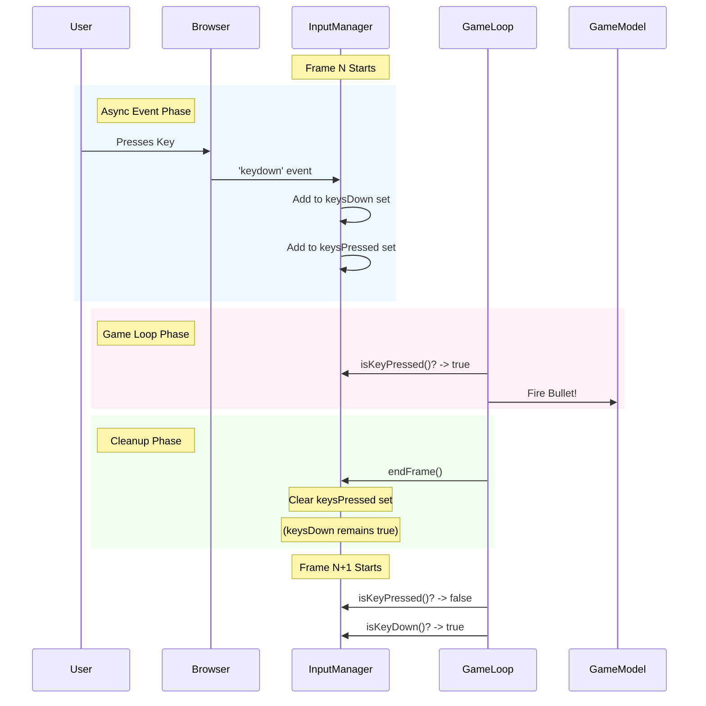
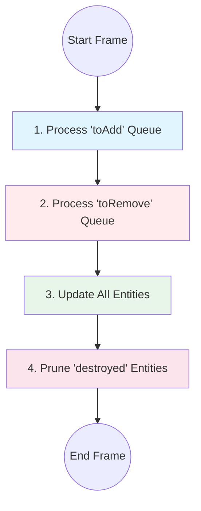

# Game Framework Infrastructure Design

> **Document Version:** 2.0  
> **Last Updated:** January 2026  
> **Status:** Current

---

## Executive Summary

This document describes the architectural design of a cross-platform 2D game framework built on TypeScript, HTML5 Canvas, and Capacitor. The framework provides a reusable foundation for developing browser-based and mobile games by abstracting common infrastructure concerns—canvas management, device scaling, game loops, and mobile deployment—into a cohesive, extensible system.

---

## Table of Contents

1. [Design Philosophy](#design-philosophy)
2. [High-Level Architecture](#high-level-architecture)
3. [Technology Stack](#technology-stack)
4. [Core Components](#core-components)
   - [The Game Loop: Update vs Render](#the-game-loop-update-vs-render)
   - [Game Base Class](#game-base-class)
   - [The requestAnimationFrame Mechanism](#the-requestanimationframe-mechanism)
   - [Canvas Management](#canvas-management)
   - [Collision Detection with AABB](#collision-detection-with-aabb)
5. [Input System](#input-system)
6. [Entity System](#entity-system)
7. [Scene System](#scene-system)
8. [Mobile Deployment with Capacitor](#mobile-deployment-with-capacitor)
9. [Extensibility Model](#extensibility-model)
10. [Code Reference Guide](#code-reference-guide)

---

## Design Philosophy

### Why This Architecture?

Building games for both web and mobile platforms traditionally requires maintaining separate codebases or wrestling with incompatible toolchains. This framework was designed with three guiding principles:

1. **Separation of Concerns** — Infrastructure code (canvas setup, device scaling, animation loops) should be completely decoupled from game logic (entities, collisions, rendering).

2. **Convention Over Configuration** — Developers extending this framework should focus on implementing game mechanics, not boilerplate. The base class handles everything a game needs to run.

3. **Write Once, Deploy Anywhere** — The same TypeScript codebase runs in a browser during development and compiles to a native Android app, with no platform-specific code required.

### What This Achieves

- **Rapid Prototyping**: New games can be created by extending a single class and implementing two methods.
- **Consistent Behavior**: High-DPI scaling, resize handling, and frame timing work identically across all games.
- **Mobile-Ready**: Touch handling and viewport configuration are baked into the scaffold.

---

## High-Level Architecture

The framework follows a layered architecture where each layer has a single responsibility:


### Layer Responsibilities

| Layer | Responsibility |
|-------|----------------|
| **Application** | Game-specific logic, entities, input handling, and rendering |
| **Framework** | Canvas lifecycle, game loop, DPI scaling, resize events, shared utilities |
| **Platform** | Browser APIs, build tooling, native WebView adapters |

---

## Technology Stack

### Why These Technologies?

| Technology | Purpose | Rationale |
|------------|---------|-----------|
| **TypeScript** | Language | Compile-time type checking; strong IDE tooling for refactoring |
| **Vite** | Build Tool | Fast HMR; native ESM support; minimal configuration |
| **HTML5 Canvas** | Rendering | Immediate-mode graphics; hardware-accelerated compositing; universal browser support |
| **Capacitor** | Native Adapter | WebView-based native container with JavaScript-to-native bridge; plugin architecture for device APIs |

### Project Structure

```
game-scaffold/
├── src/
│   ├── Game.ts              # Base game class
│   ├── ArkanoidGame.ts      # Game implementation
│   ├── main.ts              # Entry point
│   ├── style.css            # Mobile-optimized styles
│   ├── core/                # Framework systems
│   │   ├── Entity.ts        # Entity interface
│   │   ├── EntityManager.ts # Entity lifecycle
│   │   ├── Scene.ts         # Scene abstraction
│   │   └── index.ts
│   ├── input/               # Input handling
│   │   ├── InputManager.ts  # Unified input system
│   │   └── index.ts
│   ├── entities/            # Game objects
│   │   ├── Ball.ts
│   │   ├── Paddle.ts
│   │   ├── Brick.ts
│   │   └── index.ts
│   └── utils/
│       ├── math.ts          # Vector2, AABB, CCD
│       ├── Vector3.ts       # 3D vector with projection
│       ├── index.ts
│       └── __tests__/       # Unit tests
├── android/                 # Capacitor Android project
├── dist/                    # Production build output
├── docs/                    # Technical documentation
├── index.html               # HTML shell with viewport meta
├── vite.config.ts           # Build configuration
├── vitest.config.ts         # Test configuration
├── capacitor.config.ts      # Mobile deployment config
└── package.json             # Dependencies and scripts
```

---

## Core Components

### The Game Loop: Update vs Render

#### Why Separate Update and Render?

The separation of `update()` and `render()` into distinct functions is a fundamental game development pattern known as the **Update-Render Loop** or **Fixed Timestep Pattern**. Understanding why they're separate is crucial to understanding game architecture.

**The Core Distinction:**

| Method | Purpose | What It Does | When It Matters |
|--------|---------|--------------|-----------------|
| `update(dt)` | **Logic** | Moves objects, handles physics, processes input, updates game state | Must be deterministic and frame-rate independent |
| `render()` | **Display** | Draws the current state to screen | Visual only—no game state changes |

**Why Not Combine Them?**

Consider this problematic approach:

```typescript
// BAD: Combined update and render
function gameLoop() {
  ball.x += ball.velocityX; // Logic mixed with...
  ctx.drawCircle(ball.x, ball.y); // ...rendering
}
```

Problems with this approach:

1. **Frame Rate Dependency**: If the game runs at 30 FPS on a slow device vs 60 FPS on a fast device, the ball moves at different speeds.

2. **Debugging Difficulty**: You can't pause rendering to inspect game state, or run game logic without drawing.

3. **Testing Impossibility**: Unit tests can't verify game logic without mocking the entire rendering system.

**The Correct Approach:**

```typescript
// GOOD: Separated update and render
function update(dt: number) {
  // dt (delta time) is seconds since last frame
  ball.x += ball.velocityX * dt; // Frame-rate independent!
}

function render() {
  ctx.drawCircle(ball.x, ball.y); // Just visualization
}
```

**Frame-Rate Independence Explained:**

```
At 60 FPS: dt ≈ 0.0167 seconds, ball moves velocityX × 0.0167 per frame
At 30 FPS: dt ≈ 0.0333 seconds, ball moves velocityX × 0.0333 per frame

Result: Ball moves the SAME distance per second regardless of frame rate!
```

**Visual Representation:**


**Key Takeaway:** `update()` answers "what is happening in the game world?" while `render()` answers "how do we show that to the player?" These are fundamentally different concerns that should never be mixed.

---

### Abstract Game Class

#### Why an Abstract Class?

The `Game` class exists to enforce a contract: all games in this framework must implement `update()` and `render()`. By making this an abstract class rather than an interface, we can provide a complete, working implementation of infrastructure while requiring subclasses to supply only game-specific behavior.

This design pattern is known as the **Template Method Pattern**—the base class defines the skeleton of the algorithm (the game loop), and subclasses fill in the specific steps.

#### What It Provides


#### Implementation Reference

The base class is defined in [Game.ts](file:///Users/bgdan/projects/experimental/canvas_game/game-scaffold/src/Game.ts):

```typescript
export abstract class Game {
  protected canvas: HTMLCanvasElement;
  protected ctx: CanvasRenderingContext2D;
  
  constructor(canvasId: string = 'game-canvas') {
    // Canvas creation and context acquisition
    // Resize listener registration
    // Game loop initialization
  }

  /**
   * Update game logic - called every frame BEFORE render
   * @param dt Delta time in seconds since last frame
   */
  protected abstract update(dt: number): void;

  /**
   * Render the game - called every frame AFTER update
   * Should only draw; never modify game state here
   */
  protected abstract render(): void;

  protected onResize(): void { /* optional override */ }
}
```

**Key Design Decisions:**

1. **Protected Members**: `canvas` and `ctx` are `protected` so subclasses can access them directly for rendering, but external code cannot manipulate them.

2. **Optional `onResize()`**: Not all games need resize handling. The base implementation is a no-op, but subclasses can override it. Note: subclasses must guard against being called before their properties are initialized (see ArkanoidGame implementation).

3. **Capped Delta Time**: The loop caps `dt` at 0.1 seconds to prevent physics explosions if the browser tab is backgrounded.

---

### The requestAnimationFrame Mechanism

#### What Is requestAnimationFrame?

`requestAnimationFrame` (commonly abbreviated as RAF) is a browser API specifically designed for animation. Before RAF existed, developers used `setInterval` or `setTimeout` for animations, which had significant drawbacks.

#### Why Use requestAnimationFrame?

**The Problem with setInterval/setTimeout:**

```typescript
// OLD APPROACH: Problems!
setInterval(() => {
  update();
  render();
}, 16); // Aim for ~60 FPS
```

Issues:
1. **Not synchronized with display**: The browser might repaint at different times, causing visual stuttering (screen tearing).
2. **Runs when tab is hidden**: Wastes CPU/battery when user isn't looking.
3. **No timestamp**: You have to calculate elapsed time yourself, less accurately.

**The requestAnimationFrame Solution:**

```typescript
// MODERN APPROACH: Smooth and efficient
function loop(currentTime: number) {
  update(currentTime);
  render();
  requestAnimationFrame(loop);
}
requestAnimationFrame(loop);
```

Benefits:
- **Display-synchronized**: Runs exactly when the browser is about to repaint (typically 60Hz).
- **Automatic pause**: Stops when tab is backgrounded, saving battery.
- **High-precision timestamps**: Provides sub-millisecond timing for smooth physics.

#### How It Works in Our Framework


#### Implementation Reference

From [Game.ts](file:///Users/bgdan/projects/experimental/canvas_game/game-scaffold/src/Game.ts#L72-L82):

```typescript
private loop(currentTime: number): void {
  if (!this.running) return;

  // Calculate time elapsed since last frame (in seconds)
  const deltaTime = Math.min((currentTime - this.lastTime) / 1000, 0.1);
  this.lastTime = currentTime;

  this.update(deltaTime);  // Logic phase
  this.render();           // Display phase

  requestAnimationFrame((time) => this.loop(time));
}
```

**Why cap deltaTime at 0.1 seconds?** 

If a user switches to another tab, the browser pauses RAF. When they return, the elapsed time could be several seconds. Without capping, physics calculations would "explode" (e.g., a ball moving 500 pixels in one frame). The 0.1-second cap ensures smooth recovery—the game effectively runs in "slow motion" for a few frames rather than objects teleporting across the screen.

---

### Canvas Management

#### Why Manual Canvas Creation?

Rather than placing a `<canvas>` element in the HTML, the framework creates it programmatically. This provides:

1. **Guaranteed Initialization Order**: The canvas exists only after the Game constructor runs.
2. **Consistent ID Assignment**: All games use `game-canvas` by default.
3. **Clean HTML**: The `index.html` contains no game-specific elements.

#### High-DPI Scaling

Modern devices have pixel ratios of 2x or 3x (Retina displays, mobile screens). Without proper scaling, canvas content appears blurry.

**The Problem:**

| CSS Pixels | Physical Pixels | Result |
|------------|-----------------|--------|
| 100 × 100 | 200 × 200 | Canvas is scaled up 2x → blurry |

**The Solution:**


#### Implementation Reference

From [Game.ts](file:///Users/bgdan/projects/experimental/canvas_game/game-scaffold/src/Game.ts#L44-L57):

```typescript
private resize(): void {
  const dpr = window.devicePixelRatio || 1;

  // CSS size (logical pixels) - what the user "sees"
  this.canvas.style.width = `${this.width}px`;
  this.canvas.style.height = `${this.height}px`;

  // Buffer size (physical pixels) - actual resolution
  this.canvas.width = this.width * dpr;
  this.canvas.height = this.height * dpr;

  // Scale context so we can draw in CSS coordinates
  this.ctx.scale(dpr, dpr);

  this.onResize();
}
```

After this transformation, game code can draw at coordinates like `(100, 100)` and it will appear at the correct position on any device, sharp and crisp—even on a 3x Retina display.

---

### Collision Detection with AABB

#### What is AABB?

**AABB** stands for **Axis-Aligned Bounding Box**. It is a rectangular collision shape that is always aligned with the coordinate axes (never rotated). In 2D, an AABB is defined by four values:

- `x` — Left edge position
- `y` — Top edge position  
- `width` — Horizontal size
- `height` — Vertical size

```
    x
    ├──── width ────┤
    ┌───────────────┐ ─┬─ y
    │               │  │
    │     AABB      │  height
    │               │  │
    └───────────────┘ ─┴─
```

#### Why Use AABB for Collision Detection?

AABB collision detection is the most common approach in 2D games because:

1. **Extremely Fast**: Only 4 comparisons needed to detect overlap.
2. **Simple to Implement**: No complex math like trigonometry or matrix operations.
3. **Memory Efficient**: Only 4 numbers per shape.
4. **Sufficient for Most Games**: Rectangles approximate most game objects well enough.

**Trade-offs:**

| Approach | Speed | Accuracy | Use Case |
|----------|-------|----------|----------|
| **AABB** | Very fast | Good | Rectangles, squares, rough shapes |
| Circle collision | Fast | Good | Balls, circular objects |
| Polygon collision | Slow | Precise | Complex shapes, rotated objects |
| Pixel-perfect | Very slow | Perfect | Only when absolutely necessary |

For a game like Arkanoid where all objects are rectangles, AABB is the ideal choice.

#### How AABB Collision Works

Two AABBs are colliding if and only if they overlap on **both** the X and Y axes simultaneously:


**Mathematical Conditions:**

For boxes A and B to overlap:
- A's left edge must be left of B's right edge: `A.x < B.x + B.width`
- A's right edge must be right of B's left edge: `A.x + A.width > B.x`
- A's top edge must be above B's bottom edge: `A.y < B.y + B.height`
- A's bottom edge must be below B's top edge: `A.y + A.height > B.y`

All four conditions must be true for a collision.

#### Implementation Reference

The AABB interface and collision functions are defined in [utils/math.ts](file:///Users/bgdan/projects/experimental/canvas_game/game-scaffold/src/utils/math.ts):

```typescript
/**
 * Axis-Aligned Bounding Box
 * A rectangle that is never rotated, defined by its top-left corner and dimensions.
 * Used for fast collision detection between rectangular shapes.
 */
export interface AABB {
  x: number;      // Left edge X position
  y: number;      // Top edge Y position
  width: number;  // Horizontal size
  height: number; // Vertical size
}

/**
 * Check if two axis-aligned bounding boxes are overlapping.
 * This is the fastest possible rectangle intersection test.
 * 
 * @param a First bounding box
 * @param b Second bounding box
 * @returns true if the boxes overlap, false otherwise
 */
export function aabbCollision(a: AABB, b: AABB): boolean {
  return (
    a.x < b.x + b.width &&      // A's left < B's right
    a.x + a.width > b.x &&      // A's right > B's left
    a.y < b.y + b.height &&     // A's top < B's bottom
    a.y + a.height > b.y        // A's bottom > B's top
  );
}

/**
 * Determine which side of the target box was hit by a moving box.
 * Uses the minimum overlap and velocity direction to disambiguate.
 * 
 * @param ball The moving object's bounding box
 * @param target The stationary object's bounding box
 * @param ballVelocity The moving object's velocity (used to determine approach direction)
 * @returns 'top', 'bottom', 'left', 'right', or null if no collision
 */
export function getCollisionSide(
  ball: AABB,
  target: AABB,
  ballVelocity: Vector2
): 'top' | 'bottom' | 'left' | 'right' | null {
  if (!aabbCollision(ball, target)) return null;

  // Calculate how deep the overlap is on each side
  const overlapLeft = ball.x + ball.width - target.x;
  const overlapRight = target.x + target.width - ball.x;
  const overlapTop = ball.y + ball.height - target.y;
  const overlapBottom = target.y + target.height - ball.y;

  // Find minimum overlap on each axis
  const minOverlapX = Math.min(overlapLeft, overlapRight);
  const minOverlapY = Math.min(overlapTop, overlapBottom);

  // The axis with smaller overlap is where the collision happened
  // Velocity helps disambiguate when overlaps are equal
  if (minOverlapX < minOverlapY) {
    return ballVelocity.x > 0 ? 'left' : 'right';
  } else {
    return ballVelocity.y > 0 ? 'top' : 'bottom';
  }
}
```

**How Entities Expose Their AABB:**

Each game entity provides a `bounds` getter that returns its AABB:

```typescript
// From Ball.ts
get bounds(): AABB {
  return {
    x: this.position.x - this.radius,
    y: this.position.y - this.radius,
    width: this.radius * 2,
    height: this.radius * 2,
  };
}
```

Note: The ball is a circle, but we treat it as a square bounding box for collision. This is a common approximation that's fast and "good enough" for most arcade games.

---

## Input System

### The "Frame-Based" Input Model

#### Why Not Event Listeners?

In traditional web development, we rely on event listeners (`keydown`, `click`) to trigger actions. However, in game development, this "push" model creates synchronization problems:

1.  **Timing Mismatches**: An event might fire *during* a frame calculation, changing state unpredictably in the middle of physics logic.
2.  **State Persistence**: If a player holds a key, the OS sends repeated `keydown` events at a rate determined by OS settings, not the game's framerate.
3.  **Complexity**: Managing dozens of event listeners across different game states (menu vs game) becomes unwieldy.

#### The Solution: Polling

Instead of reacting to events immediately, the `InputManager` captures them and stores the state. The game loop then **polls** this state at the beginning of each frame. This ensures that:

-   **Determinism**: Input state is constant throughout the entire `update()` call.
-   **Synchronization**: Actions happen exactly when the game is ready to process them.
-   **Uniformity**: Keyboard, Mouse, and Touch data are accessed via the same API.

### InputManager Deep Dive

**Location:** [src/input/InputManager.ts](file:///Users/bgdan/projects/experimental/canvas_game/game-scaffold/src/input/InputManager.ts)

The `InputManager` categorizes input interactions into two types: **Continuous** (holding a button) and **Discrete** (pressing a button).

#### 1. Discrete vs. Continuous Actions

| Action Type | Examples | API Method | Logic |
| :--- | :--- | :--- | :--- |
| **Continuous** | Movement, accelerating | `isKeyDown('ArrowUp')` | True as long as key is held |
| **Discrete** | Jumping, firing, pausing | `isKeyPressed('Space')` | True for **only one frame** |

#### 2. The Frame Lifecycle

The system requires a strict lifecycle to manage discrete events correctly. If we didn't clear the "pressed" state at the end of the frame, a single button press might trigger a jump for multiple consecutive frames!



#### 3. Unified Pointer System

Handling Mouse and Touch separately leads to duplicated code. The `InputManager` unifies them into a "Pointer" abstraction.

-   **Primary Pointer**: The left mouse button OR the first active finger touch.
-   **Position**: `pointerPosition` tracks x/y coordinates in screen space.

This means you can write one logic block for "drag paddle" that works instantly on both Desktop and Mobile.

#### Implementation Reference

```typescript
// Example: Entity accessing input
update(dt: number) {
  // Continuous: Move while holding
  if (this.input.isKeyDown('ArrowRight')) {
    this.position.x += this.speed * dt;
  }

  // Discrete: Jump once per press
  if (this.input.isKeyPressed('Space')) {
    this.velocity.y = -500;
  }
}
```

---

## Entity System

### The "Deferred Mutation" Pattern

#### The Problem: Modifying Collections During Iteration

A common bug in game engines occurs when an entity tries to create or destroy another entity *during* the update loop.

```typescript
// BAD: Modifying array while iterating
entities.forEach(entity => {
  entity.update();
  if (entity.isDead) {
    entities.splice(i, 1); // CRASH! Index shifts, skipping elements
  }
  if (entity.shoots) {
    entities.push(new Bullet()); // Might be updated immediately in this frame!
  }
});
```

#### The Solution: Command Queues

The `EntityManager` solves this by decoupling the **request** to change the list from the **execution** of that change.

1.  **Queue Phase**: When `add()` or `remove()` is called, we just push the entity to a temporary `toAdd` or `toRemove` list.
2.  **Execution Phase**: At the *start* of the next frame, we process these queues safely.

### EntityManager Deep Dive

**Location:** [src/core/EntityManager.ts](file:///Users/bgdan/projects/experimental/canvas_game/game-scaffold/src/core/EntityManager.ts)

#### Update Cycle Diagram

This safe lifecycle ensures that the list of entities remains stable while `update()` is running.



#### Z-Index Rendering (Painter's Algorithm)

The framework uses a simple **Painter's Algorithm** for depth. It sorts entities by their `position.z` before rendering.

-   **High Z**: "Further away" -> Drawn first -> Background
-   **Low Z**: "Closer" -> Drawn last -> Foreground

```typescript
render(ctx) {
  // Sort descending: Z=10 draws before Z=1
  const sorted = entities.sort((a, b) => b.position.z - a.position.z);
  sorted.forEach(e => e.render(ctx));
}
```

This allows pseudo-3D effects (parallax) without a real 3D engine.

### Entity Interface

**Location:** [src/core/Entity.ts](file:///Users/bgdan/projects/experimental/canvas_game/game-scaffold/src/core/Entity.ts)

```typescript
interface Entity {
  position: Vector3;          // World position (z for depth)
  readonly bounds: AABB;      // Collision box
  update(dt: number): void;   // Per-frame logic
  render(ctx: CanvasRenderingContext2D): void;
  destroyed: boolean;         // Mark for removal
}
```

---

## Scene System

### The State Pattern for Games

As games grow, putting all logic in one `Game` class becomes unmanageable. You need different modes: "Menu", "Playing", "GameOver", "credits".

The **Scene System** applies the **State Pattern** to solve this. The `Game` class delegates all `update` and `render` calls to the *current active scene*.

### Scene Deep Dive

**Location:** [src/core/Scene.ts](file:///Users/bgdan/projects/experimental/canvas_game/game-scaffold/src/core/Scene.ts)

A `Scene` is essentially a mini-Game. It has its own `EntityManager` and lifecycle hooks. 

#### Lifecycle Hooks

Scenes have a rich lifecycle that allows them to manage resources effectively.

```mermaid
stateDiagram-v2
    [*] --> Inactive
    
    Inactive --> Active: setScene(NewScene)
    Note on link: onEnter() called
    
    state Active {
        Running --> Paused: game.pause()
        Note on link: onPause()
        
        Paused --> Running: game.resume()
        Note on link: onResume()
    }
    
    Active --> Inactive: setScene(Other)
    Note on link: onExit()
```

-   **onEnter()**: Setup. Load levels, spawn entities, start music.
-   **onExit()**: Cleanup. Stop music, clear entities (`this.entities.clear()` happens automatically).
-   **onPause/onResume()**: Handle app backgrounding (e.g. stop timers but keep entities).

#### Implementation Example

```typescript
class MainMenuScene extends Scene {
  onEnter() {
    this.entities.add(new Button("Start", () => {
      this.game.setScene(new GameplayScene());
    }));
  }
  
  render(ctx) {
    this.entities.render(ctx); // Render buttons
    ctx.fillText("ARKANOID", 100, 100); // Draw title
  }
}
```

This makes the `Game` class very simple—it just manages the `currentScene` pointer.


---

## Mobile Deployment with Capacitor

### What Is Capacitor?

**Capacitor** is a native runtime adapter that embeds web applications inside platform-native WebView containers (Android WebView, iOS WKWebView). It provides:

- A JavaScript-to-native bridge for invoking platform APIs
- A plugin architecture for extending native capabilities
- Build tooling for packaging web assets into native app bundles

Architecturally, Capacitor acts as a compatibility layer between web code and native platform APIs, similar to Electron for desktop but targeting mobile platforms.

### Why Use Capacitor?

| Consideration | Capacitor | Alternatives |
|---------------|-----------|---------------|
| **Runtime** | WebView + native bridge | React Native: JSI bridge; Flutter: Skia rendering |
| **Code Sharing** | 100% web code reuse | RN/Flutter require platform-specific adaptations |
| **Performance** | WebView-bound (sufficient for 2D Canvas at 60 FPS) | RN/Flutter can be faster for complex rendering |
| **Native API Access** | Plugin-based, async bridge | RN: Turbo Modules; Flutter: Platform Channels |
| **Bundle Size** | Depends on WebView availability | Self-contained runtime adds ~5-15MB |

For this framework, Capacitor is optimal because Canvas rendering performs well in WebView and no native UI components are needed.

### How Deployment Works


### Configuration Reference

**vite.config.ts** — Critical settings for Capacitor compatibility:

```typescript
export default defineConfig({
  base: './',  // CRITICAL: Use relative paths so assets load in WebView
  build: { outDir: 'dist' },
  server: { host: true }  // Expose dev server on LAN for device testing
})
```

**capacitor.config.ts** — Tells Capacitor where to find the web build:

```typescript
const config: CapacitorConfig = {
  appId: 'com.example.gamescaffold',  // Unique app identifier
  appName: 'GameScaffold',            // Display name on device
  webDir: 'dist'                       // Where Vite outputs the build
};
```

### Build Commands

| Command | Action |
|---------|--------|
| `npm run dev` | Start Vite dev server with Hot Module Replacement |
| `npm run build:mobile` | Build for production and sync to Android project |
| `npm run open:android` | Open the Android project in Android Studio |

### Testing on Device

You can test the web version on your mobile device by:

1. Run `npm run dev` — Vite will show a Network URL (e.g., `http://192.168.1.100:5173`)
2. Open that URL on your phone's browser
3. The game runs with touch input, just like the native app

For testing the actual native app, use `npm run build:mobile` then run from Android Studio.

---

## Extensibility Model

### Creating a New Game

To create a new game, developers need only:

1. Create a new class extending `Game`
2. Implement `update(dt: number)` for game logic
3. Implement `render()` for drawing
4. Optionally override `onResize()` for responsive layouts

```typescript
import { Game } from './Game';

export class Pong extends Game {
  private leftPaddle: Paddle;
  private rightPaddle: Paddle;
  private ball: Ball;

  constructor() {
    super('game-canvas');
    // Initialize game objects AFTER super()
    this.leftPaddle = new Paddle(/* ... */);
    this.rightPaddle = new Paddle(/* ... */);
    this.ball = new Ball(/* ... */);
  }

  protected update(dt: number): void {
    // Logic phase: update positions, handle physics
    this.leftPaddle.update(dt);
    this.rightPaddle.update(dt);
    this.ball.update(dt);
    this.handleCollisions();
  }

  protected render(): void {
    // Display phase: draw everything to canvas
    this.ctx.fillStyle = '#000';
    this.ctx.fillRect(0, 0, this.width, this.height);
    this.leftPaddle.render(this.ctx);
    this.rightPaddle.render(this.ctx);
    this.ball.render(this.ctx);
  }

  protected onResize(): void {
    // Guard against being called before initialization
    if (this.leftPaddle) {
      // Reposition paddles on resize
    }
  }
}
```

### Entity Design Pattern

Game entities should follow a consistent interface:

```typescript
interface Entity {
  update(dt: number): void;
  render(ctx: CanvasRenderingContext2D): void;
  bounds: AABB;  // For collision detection
}
```

This makes it trivial to add new entity types that integrate with existing collision and rendering systems.

---

## Code Reference Guide

### Quick Links

| File | Purpose | Link |
|------|---------|------|
| `Game.ts` | Abstract base class | [View](file:///Users/bgdan/projects/experimental/canvas_game/game-scaffold/src/Game.ts) |
| `ArkanoidGame.ts` | Reference implementation | [View](file:///Users/bgdan/projects/experimental/canvas_game/game-scaffold/src/ArkanoidGame.ts) |
| `main.ts` | Application entry point | [View](file:///Users/bgdan/projects/experimental/canvas_game/game-scaffold/src/main.ts) |
| `utils/math.ts` | Vector and collision utilities | [View](file:///Users/bgdan/projects/experimental/canvas_game/game-scaffold/src/utils/math.ts) |
| `entities/` | Game object implementations | [View](file:///Users/bgdan/projects/experimental/canvas_game/game-scaffold/src/entities/) |
| `vite.config.ts` | Build configuration | [View](file:///Users/bgdan/projects/experimental/canvas_game/game-scaffold/vite.config.ts) |
| `capacitor.config.ts` | Mobile deployment | [View](file:///Users/bgdan/projects/experimental/canvas_game/game-scaffold/capacitor.config.ts) |

---

## Appendix: Design Decisions Log

| Decision | Alternatives Considered | Rationale |
|----------|------------------------|-----------|
| Abstract class over interface | Interface + composition | Need default implementations; TypeScript interfaces don't support this |
| Programmatic canvas creation | Declarative HTML canvas | Ensures initialization order; keeps HTML clean |
| `devicePixelRatio` scaling | CSS scaling only | Achieves pixel-perfect rendering on HiDPI displays |
| Capacitor over Cordova | React Native, Flutter | Reuses existing web skills; no additional framework to learn |
| Vite over Webpack | Create-React-App, Parcel | Fastest Hot Module Replacement; native ECMAScript module support; minimal configuration |
| AABB collision over circles | Pixel-perfect, polygon collision | Fast enough for arcade games; simple to implement and debug |
| Game-level input handling | Framework input abstraction | Input needs vary too much between games; browser APIs work everywhere |

---

## Glossary

| Term | Definition |
|------|------------|
| **AABB** | Axis-Aligned Bounding Box — non-rotatable rectangular collision primitive |
| **DPR** | Device Pixel Ratio — physical-to-logical pixel scaling factor |
| **HMR** | Hot Module Replacement — incremental module updates without full page reload |
| **RAF** | requestAnimationFrame — VSync-aligned callback scheduling API |

---

*End of Document*
